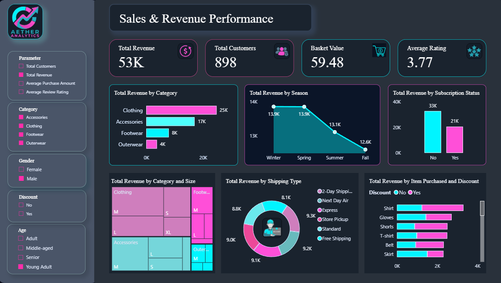

# 📊 Aether Analytics – Sales & Revenue Performance Dashboard

## 🚀 Project Overview

Aether Analytics is an end-to-end Sales Analytics project that transforms raw retail transaction data into actionable business insights.

The project follows a complete analytics workflow:

**Raw Dataset → Data Cleaning → Feature Engineering (SQL) → Data Modeling → Power BI Dashboard**

Using SQL, the dataset was cleaned, transformed, and enriched with business-focused analytical features before being visualized in Power BI through an interactive dashboard.

The final dashboard helps stakeholders monitor revenue performance, customer behavior, product trends, subscription effectiveness, and operational metrics.

---

## 📸 Dashboard Preview

  

---

# 🔄 Project Workflow

### 1️⃣ Data Preparation

The raw retail dataset was imported into SQL Server for preprocessing and analysis.

Key tasks included:

* Data validation
* Data cleaning
* Handling inconsistencies
* Preparing analytical fields
* Business-oriented feature extraction

---

### 2️⃣ Feature Engineering using SQL

Several business questions were explored using SQL to derive meaningful insights and support dashboard development.

### Revenue Analysis

* Revenue generated by each gender
* Revenue contribution by age group
* Revenue comparison by subscription status

### Customer Behavior Analysis

* Customers using discounts while spending above average
* Customer segmentation based on previous purchases
* Repeat buyer subscription analysis

### Product Performance Analysis

* Top-rated products
* Most purchased products by category
* Products with highest discount utilization

### Operational Analysis

* Purchase amount comparison across shipping methods
* Subscription impact on customer spending

These SQL queries served as the foundation for the dashboard KPIs and visualizations.

---

### 3️⃣ Dashboard Development

After feature extraction and validation, the transformed dataset was imported into Power BI.

Using DAX measures, calculated metrics, and interactive visualizations, the dashboard was developed to provide an executive-level view of business performance.

---

# 📸 Sales & Revenue Performance Dashboard

The dashboard provides a centralized view of revenue, customers, products, and purchasing behavior.

It enables users to analyze performance through multiple dimensions including category, season, subscription status, shipping preferences, demographics, and discount utilization.

---

## 💰 KPI Section

The KPI cards at the top provide an instant snapshot of business performance.

### Total Revenue

Displays total revenue generated across all transactions.

### Total Customers

Shows the number of unique customers.

### Basket Value

Represents the average purchase value per transaction.

### Average Rating

Measures customer satisfaction through product reviews.

These KPIs help stakeholders quickly evaluate overall business health.

---

## 📦 Revenue by Category

This visualization compares revenue generated across product categories:

* Clothing
* Accessories
* Footwear
* Outerwear

### Insight

Clothing contributes the largest share of revenue, making it the primary revenue-driving category.

---

## 🌤️ Revenue by Season

Seasonal analysis tracks revenue across:

* Winter
* Spring
* Summer
* Fall

### Insight

Winter and Spring generate the strongest revenue performance, indicating seasonal purchasing trends.

---

## ⭐ Revenue by Subscription Status

This chart evaluates the revenue impact of customer subscriptions.

Categories include:

* Subscribed Customers
* Non-Subscribed Customers

### Business Value

Helps measure customer loyalty program effectiveness and subscription-driven revenue.

---

## 👕 Revenue by Category and Size

The treemap provides a detailed breakdown of revenue by:

* Product Category
* Product Size

### Business Value

Supports inventory planning by identifying the most profitable category-size combinations.

---

## 🚚 Revenue by Shipping Type

Revenue is analyzed across shipping methods such as:

* Free Shipping
* Standard Shipping
* Store Pickup
* Express Delivery
* Next Day Air
* 2-Day Shipping

### Business Value

Helps understand customer delivery preferences and optimize logistics operations.

---

## 🏷️ Revenue by Item Purchased and Discount

This visualization compares product revenue with and without discounts.

Products include:

* Shirts
* Gloves
* Shorts
* T-Shirts
* Belts
* Skirts

### Insight

Discounts significantly influence purchasing behavior for several product categories.

---

## 🎛️ Interactive Filters

The dashboard includes dynamic filters for:

### Parameter Selection

Users can switch between:

* Total Customers
* Total Revenue
* Average Purchase Amount
* Average Review Rating

### Additional Filters

* Category
* Gender
* Discount Status
* Age Group

These slicers allow users to create customized analytical views.

---

# 📈 Key Insights

✅ Clothing is the highest revenue-generating category.

✅ Winter and Spring contribute the strongest sales performance.

✅ Customer purchasing behavior varies significantly across age groups.

✅ Subscription status influences overall revenue generation.

✅ Discount campaigns increase product engagement across several categories.

✅ Shipping preferences impact revenue distribution.

✅ Customer segmentation helps identify loyal and repeat buyers.

---

# 🛠️ Tools & Technologies

| Technology    | Purpose                             |
| ------------- | ----------------------------------- |
| SQL Server    | Data Cleaning & Feature Engineering |
| SQL Queries   | Business Analysis                   |
| Power BI      | Dashboard Development               |
| DAX           | KPI Calculations                    |
| Power Query   | Data Transformation                 |
| Data Modeling | Relationship Management             |

---

# ✨ Key Features

* End-to-End Analytics Workflow
* SQL-Based Feature Engineering
* Revenue Performance Monitoring
* Customer Behavior Analysis
* Product Performance Insights
* Subscription Analysis
* Discount Impact Analysis
* Seasonal Revenue Trends
* Shipping Performance Analysis
* Interactive Power BI Dashboard
* Dynamic KPI Selection
* Advanced Filtering Capabilities

---

## 👩‍💻 Author

**Purva**

Data Analyst | Power BI | SQL | Python | Excel

Passionate about transforming raw data into actionable insights through analytics, visualization, and business intelligence.
